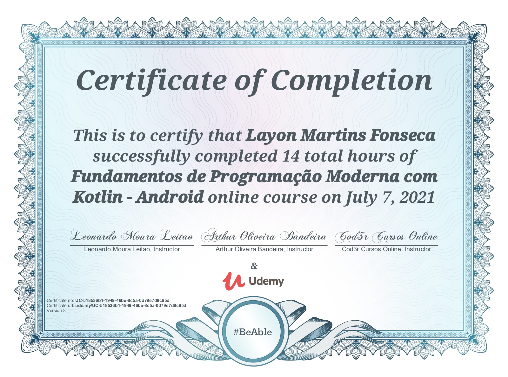

## Curso de Fundamentos de Programação Moderna com Kotlin - Android

### Kotlin:
* Estruturas de Controle
* Operadores
* Null Safety
* Checagem de Tipos e Cast
* Classes
* Funções
* Lambdas
* Coleções
* OO: Encapsulamento, Herança e Polimorfismo
* Enumerações
* Generics
* Reflexão
* Anotação
* Sobrecarga de Operadores
* Projeto Final Campo Minado:

Reference: https://www.udemy.com/course/curso-kotlin-pt/learn/lecture/7644508#overview
